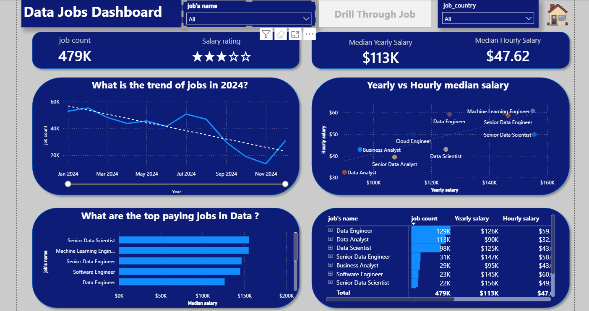
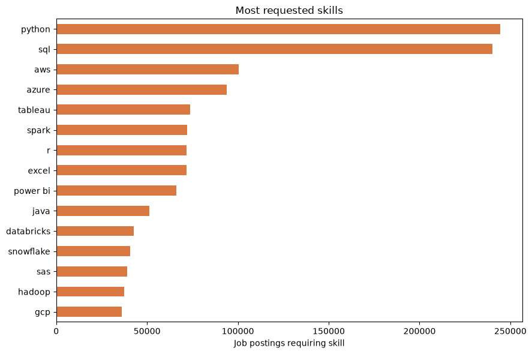
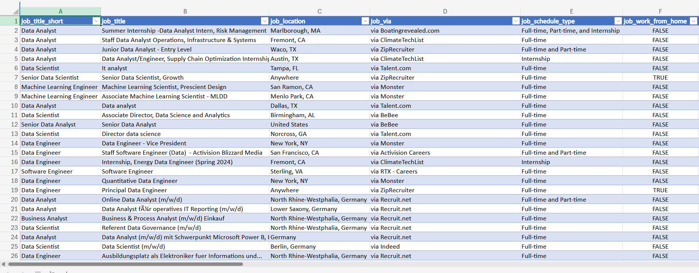
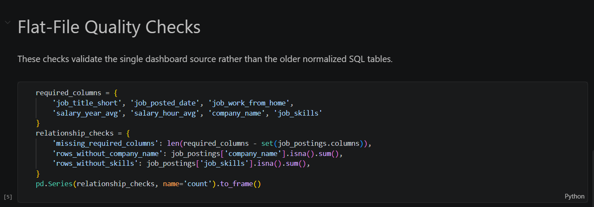
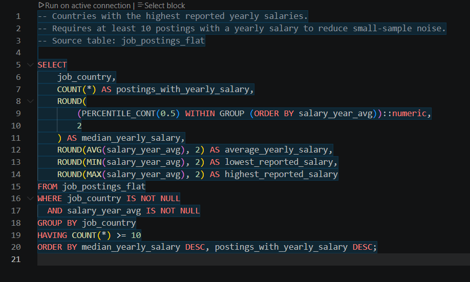
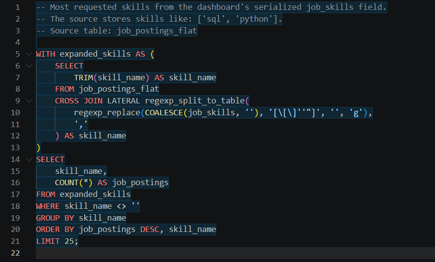
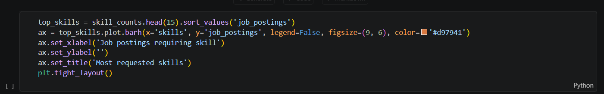

# 📊 Data Jobs Market Analysis

An end-to-end analysis of the 2024 data jobs market, built from a dashboard-aligned CSV source to Python, PostgreSQL, and Power BI.

The project focuses on one practical question:

> What roles, skills, work arrangements, and salary signals define the data jobs market?

## 🧭 Project Overview

This project combines data validation, SQL business analysis, Python exploration, and Power BI visualization into one connected workflow. The Power BI dashboard is the primary output and source of truth for the project.

```text
Dashboard-aligned CSV
   ↓
Python validation and exploration
   ↓
PostgreSQL SQL analysis
   ↓
Power BI dashboard
```

## 🔍 Main Findings

The dashboard provides the main project findings for the 2024 job market:

- The dataset contains approximately **479K job postings**.
- The displayed median yearly salary is approximately **$113K**.
- The displayed median hourly salary is approximately **$47.62**.
- The dashboard shows job-volume changes throughout 2024, with the strongest and weakest months visible in the trend chart.
- Senior Data Scientist, Machine Learning Engineer, and Senior Data Engineer appear among the highest-paying job categories in the dashboard view.
- Python and SQL are the two most requested skills in the supporting analysis.

The Python and SQL work supports and explains the dashboard. It should not be interpreted as a replacement for the Power BI model.

## 📸 Project Preview

### 📊 Power BI Dashboard

The final dashboard brings the main results together through KPI cards, a 2024 job trend, yearly-versus-hourly salary comparisons, top-paying roles, and a detailed job-category table.



### 🐍 Python Role Analysis

The Python notebook explores the dashboard-aligned source and confirms the distribution of job categories in the dataset.



The chart is produced with this Python code:

```python
top_roles = role_counts.head(10).sort_values('job_postings')
ax = top_roles.plot.barh(
    x='job_title_short',
    y='job_postings',
    legend=False,
    figsize=(9, 5),
    color='#2f6f73'
)
ax.set_xlabel('Job postings')
ax.set_ylabel('')
ax.set_title('Top job categories by posting volume')
plt.tight_layout()
```

### 🧪 SQL and Data Evidence

The analysis is supported by CSV inspection, Python validation, and three different SQL business questions.









<details>
<summary>Additional evidence</summary>



</details>

## 🛠️ Tools Used

- **Power BI:** building the primary interactive dashboard and presenting the final findings.
- **Python:** validating the flat source and exploring roles, work arrangements, salaries, and skills.
- **PostgreSQL:** running monthly posting, country salary, and skill-demand analyses.
- **Pandas and Matplotlib:** loading the CSV and creating supporting analysis charts.

## 🗂️ Analysis Stages

### 1. 📄 Dashboard-Aligned Source

[job_postings_flat.csv](data/job_postings_flat.csv) is the only published data source. It contains the fields used by the Power BI model, including job titles, locations, dates, work arrangements, salaries, company names, and serialized skill lists.

The source contains **478,895 job postings** and covers **January 1, 2024 through December 31, 2024**.

### 2. 🧹 Python Data Validation

[01_data_exploration.ipynb](notebooks/01_data_exploration.ipynb) checks:

- table size and column structure,
- missing values,
- duplicate records,
- required dashboard fields,
- missing posting dates,
- and the date coverage of the source.

The validation found 173 exact duplicate rows and 68,870 postings without skill data. These records remain documented rather than silently removed.

### 3. 📈 Python Job Market Exploration

[02_job_market_analysis.ipynb](notebooks/02_job_market_analysis.ipynb) explores:

- job-posting volume by role,
- remote and non-remote work,
- reported yearly and hourly salaries,
- median salary by job category,
- and the most requested skills.

The notebook uses the dashboard-aligned CSV directly. Its loading cell has optional limits for responsive exploration; set `USE_FULL_DATA = True` when a full-file analysis is needed.

### 4. 🧮 SQL Business Analysis

The SQL folder contains three distinct analyses using the same `job_postings_flat` table:

- [1_monthly_postings.sql](sql/1_monthly_postings.sql) measures monthly job volume and remote-work share.
- [2_highest_paying_countries.sql](sql/2_highest_paying_countries.sql) ranks countries by median reported yearly salary and requires at least 10 salary observations per country.
- [3_most_requested_skills.sql](sql/3_most_requested_skills.sql) expands the serialized `job_skills` field and ranks skills by posting count.

Each query answers a different question: when jobs were posted, where reported pay was highest, and which skills appeared most often.

### 5. 📊 Power BI Dashboard

[Data_jobs_Dashboard.pbix](dashboard/Data_jobs_Dashboard.pbix) is the primary project deliverable. It includes:

- KPI cards for job count and salary metrics,
- monthly job-posting trend,
- yearly-versus-hourly median salary comparison,
- highest-paying job categories,
- and a detailed job-category table.

## 🧩 Data Model

```text
job_postings_flat
```

The project uses one flattened table so the Python, SQL, and Power BI layers all reference the same dashboard-aligned source. Skills are stored in serialized `job_skills` and `job_type_skills` fields.

## 📐 Business Rules and Caveats

- The Power BI dashboard is the primary source of truth for the final project story.
- The CSV is an analytical snapshot, not a live job-market feed.
- Salary metrics use reported salary fields and do not represent every posting.
- Country salary rankings exclude countries with fewer than 10 yearly-salary observations.
- Skill counts show how often a skill is associated with postings; they do not measure proficiency.
- The Python notebook may use a limited sample by default for performance, while the dashboard displays the full 2024 model.
- The source contains duplicate rows and missing skill values, which are documented as data-quality findings.

## 🚀 Reproducing the Project

1. Install the Python dependencies:

   ```text
   pip install -r requirements.txt
   ```

2. Load `data/job_postings_flat.csv` into a PostgreSQL table named `job_postings_flat`.
3. Run the SQL files in the `sql` folder individually or in numbered order.
4. Open the notebooks with the project Python environment.
5. Open [Data_jobs_Dashboard.pbix](dashboard/Data_jobs_Dashboard.pbix) in Power BI. Its model is aligned with the flat CSV source.

## 📁 Repository Structure

```text
data/job_postings_flat.csv                 Dashboard-aligned source data
sql/                                       Three PostgreSQL analysis queries
notebooks/                                 Two Python analysis notebooks
dashboard/Data_jobs_Dashboard.pbix        Final Power BI dashboard
images/                                    Dashboard, SQL, CSV, and Python evidence
requirements.txt                           Python dependencies
```

## ✅ Project Status

- ✅ Dashboard-aligned 2024 source data
- ✅ Python data-quality validation
- ✅ Python job-market exploration
- ✅ Three distinct SQL analyses
- ✅ Power BI dashboard
- ✅ Dashboard, SQL, CSV, and Python evidence
- ✅ Portfolio-ready README
